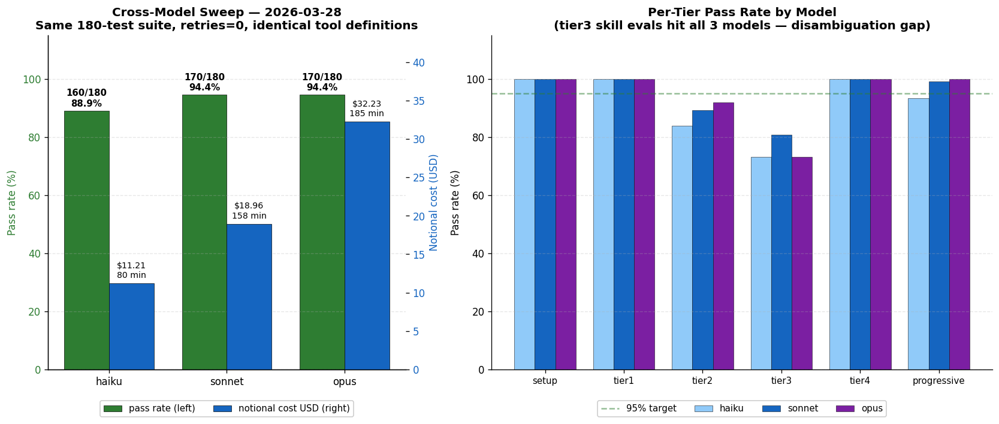
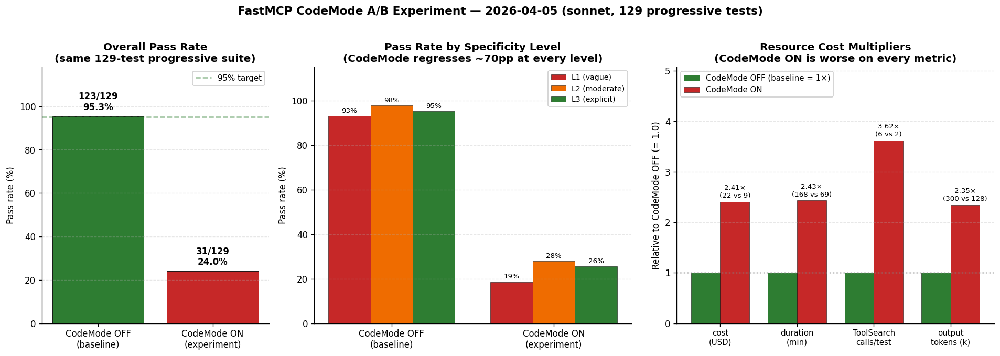

# LLM Agent Testing — openstudio-mcp

**Technical report on the methodology, implementation, and results of the LLM behavioral test suite for openstudio-mcp, an MCP server exposing ~142 building-energy-modeling tools.**

The suite runs a real Claude Code agent against a real openstudio-mcp Docker container, measures whether the agent discovers and calls the correct MCP tools from natural-language prompts, and tracks the result over time. As of the most recent run (Run 15, 2026-04-05) the suite passes **123/129 (95.3%)** on the progressive diagnostic and **170/180 (94.4%)** on the full-suite cross-model baseline (Run 14, 2026-03-28).

---

## 1. Problem statement

Unit and integration tests verify that a tool works in isolation — call it with these arguments, assert on the response. They do **not** verify that an LLM agent, reading a user's natural-language request, will discover the right tool out of 142 candidates, choose appropriate arguments, and sequence multiple calls correctly. That is the actual user experience of an MCP server, and it is only measurable end-to-end.

Failures unique to LLM behavior that only this suite catches:

- Agent writes raw IDF files via `Bash`/`Edit`/`Write` instead of calling MCP tools (guardrail regression).
- Agent gets stuck in a `list_files` loop instead of calling the right domain tool.
- A tool exists, its code is correct, but its docstring has no discoverable keywords — so the agent never picks it even at moderate prompt specificity.
- A rename or reorganization breaks every natural-language prompt that doesn't include the new name.
- A "confusion pair" — two tools that both plausibly match a prompt — resolves to the wrong one.

The LLM suite is the only gate that measures agent behavior against a real Claude session hitting a real openstudio-mcp container, and it is the basis for the pass-rate trajectory shown throughout this report.

---

## 2. Architecture

```
pytest (tests/llm/conftest.py)
  │
  ├─ pytest_runtest_protocol ─→ retry loop (up to LLM_TESTS_RETRIES)
  │
  └─ run_claude(prompt, ...)   (tests/llm/runner.py)
        │
        └─ subprocess: claude -p "<prompt>"
                         --output-format stream-json --verbose
                         --mcp-config <generated mcp.json>
                         --max-turns N  --model sonnet
              │
              ├─ stdin ←─── NDJSON stream ───→ _parse_stream_json()
              │                                      │
              │                                      └─→ ClaudeResult
              │                                          (tool_calls, tokens, cost,
              │                                           num_turns, final_text)
              │
              └─ MCP stdio → openstudio-mcp Docker container
                                ├─ stdout_suppression (SWIG safe)
                                ├─ 142 MCP tools
                                └─ shared /runs volume (baseline models)
```

### Key implementation points

| Concern | Where | Detail |
|---|---|---|
| Subprocess spawn | `runner.py:181-239` `run_claude()` | Writes temp `mcp.json`, spawns CLI. Strips `CLAUDECODE` env var (nested `claude -p` fails otherwise). |
| Output parsing | `runner.py:242-261` `_parse_stream_json()` | `--output-format stream-json --verbose` is **mandatory** — plain `json` drops `tool_use` blocks. |
| Tool-call extraction | `runner.py:61-106` `ClaudeResult` | Two views: `tool_calls` (all, incl. builtins like ToolSearch/Bash) and `mcp_tool_calls` (MCP only). |
| Markers & auto-tagging | `conftest.py:42-53, 252-278` | `llm`, `tier1-4`, `stable`, `flaky`, `smoke`, `progressive`, `generic`. Auto-tagged via `FLAKY_TESTS` frozenset. |
| Retry logic | `conftest.py:281-323` | Custom `pytest_runtest_protocol` hook. Each retry consumes one prompt from the budget. |
| Benchmark collection | `conftest.py:342-412, 434-692` | `pytest_runtest_logreport` stores per-test metrics. Session end writes `benchmark.json` / `benchmark.md` / `benchmark_history.json`. |
| Failure classification | `conftest.py:383-390` | `timeout` · `no_mcp_tool` · `wrong_tool`. |
| Prompt budget | `conftest.py` (`LLM_TESTS_MAX_PROMPTS`, default 180) | Hard cap prevents runaway cost during iteration. |
| Skill eval auto-discovery | `eval_parser.py:48-90` | Scrapes "Should trigger" / "Should NOT trigger" tables from `.claude/skills/*/eval.md`. |

### Environment knobs

| Var | Default | Purpose |
|---|---|---|
| `LLM_TESTS_ENABLED` | unset | Must be `1` to enable the suite |
| `LLM_TESTS_MODEL` | `sonnet` | `sonnet` / `haiku` / `opus` |
| `LLM_TESTS_RETRIES` | `0` | Retry count for non-determinism |
| `LLM_TESTS_MAX_PROMPTS` | `180` | Hard budget cap |
| `LLM_TESTS_TIER` | `all` | `1` / `2` / `3` / `4` / `all` |
| `LLM_TESTS_RUNS_DIR` | `/tmp/llm-test-runs` | Host path mounted as `/runs` in Docker |
| `OSMCP_CODE_MODE` | `0` | FastMCP CodeMode toggle (see §9) |

---

## 3. Test taxonomy

Ten test files, organized by what the agent is asked to do.

| File | Tier | ~Count | Purpose | Pass‑rate signal |
|---|---|---|---|---|
| `test_01_setup.py` | setup | 6 | Creates baseline/HVAC/example models in `/runs`. All other tests depend on these. Prompts use explicit tool names to minimize non-determinism. | Dependency gate |
| `test_02_tool_selection.py` | tier1 | 4 | Single-tool discovery, **no model state** (e.g. "What is the server status?"). Fastest tests. | Baseline discovery |
| `test_03_eval_cases.py` | tier3 | 26 | Auto-parsed from `.claude/skills/*/eval.md` "Should trigger" tables. Keeps tests DRY and co-located with skill definitions. | Skill discovery |
| `test_04_workflows.py` | tier2 | 37 | Multi-step chains (3-5 MCP calls): load → weather → HVAC → simulate → extract. | Multi-step composition |
| `test_05_guardrails.py` | tier4 | 3 | **Regression gate:** agent must NOT use `Bash`/`Edit`/`Write` to bypass MCP tools. | Safety / bypass |
| `test_06_progressive.py` | progressive | 104-129 | **The core diagnostic.** 43 operations × 3 specificity levels. | Tool description quality |
| `test_07_fourpipe_e2e.py` | tier2 | 1 | Full retrofit on 44-zone SystemD model using natural language (no tool names). Two simulations, 40+ turns, ~5 min. | Real-user session |
| `test_08_measure_authoring.py` | tier2 | 8 | Custom measure create/edit/test/export. Regression tests pulled from debug-session JSON exports. | Authoring workflows |
| `test_09_tool_routing.py` | tier4 | 4 | A/B baseline: all 142 tools vs `recommend_tools` routing. Not in CI. | Tool-routing efficiency |
| `test_10_confusion_pairs.py` | tier4 | 8 | Prompts that could reasonably trigger either of two similar tools (`run_qaqc_checks` vs `validate_model`). | Disambiguation |

### The progressive test pattern (L1 / L2 / L3)

Each operation is tested with **three prompts of increasing specificity**:

| Level | Example (add HVAC) | What it measures |
|---|---|---|
| **L1 — vague** | *"Add HVAC to the building"* | Can the agent discover the tool from keyword scraps alone? → **docstring keyword quality** |
| **L2 — moderate** | *"Add a VAV reheat system to all 10 zones"* | With domain context, can the agent pick the right tool among near-neighbors? → **tool discovery / ToolSearch** |
| **L3 — explicit** | *"Use add_baseline_system to add System 7 VAV reheat"* | Given the exact tool name, does the tool work? → **tool code / API correctness** |

The **gap between levels** is the diagnostic:

- **L1 fails, L2/L3 pass** → docstring is missing keywords. Fast fix.
- **L2 fails, L3 passes** → tool is hard to discover even with context. Fix ToolSearch indexing or tool name.
- **L3 fails** → tool is broken. Fix the code.
- **All three fail** → a true regression (the tool was working and now isn't). This is the most serious signal — Run 15's `edit_measure` is a current example.

This decomposition is why the progressive tier is the most useful part of the suite: it points at the cause, not just the symptom.

---

## 4. What gets measured

Every `run_claude()` call yields a `ClaudeResult`. These fields are written to `benchmark.json`, aggregated into `benchmark.md`, and appended to `benchmark_history.json`.

**Per test:** `passed` · `attempt` (1 = first try, 2+ = flaky) · `duration_s` · `num_turns` · `num_tool_calls` · `tool_calls` (ordered list) · `input_tokens` / `output_tokens` / `cache_read_tokens` · `cost_usd` (notional — free on Claude Max) · `failure_mode` (timeout / no_mcp_tool / wrong_tool) · `toolsearch_count` · `code_mode_active`.

**Aggregates:** per-tier pass rate, per-L1/L2/L3 pass rate, token profile by tier, failed-test drill-down with tool sequences, run history (last 50 runs).

**Explicit gaps (things we don't measure yet):**

- **Parameter correctness** — a test passes if the right tool is called, even with wrong arguments.
- **First-attempt pass rate** — retries mask flakiness. Only `attempt` captures it, not aggregates.
- **Time-to-first-tool** — slow ToolSearch discovery isn't penalized.
- **Error recovery rate** — when a tool returns `ok:False`, does the agent retry or give up?

---

## 5. Results

### 5.1  Pass-rate history — 16 runs across one month


The blue line traces the pass rate of the sonnet-on-default-config suite across 15 sequential runs from 2026-03-05 to 2026-04-05; the tan bars (right axis) show how many tests each run attempted. Four red-circled letters mark the inflection points that actually moved the number. **A** is the single biggest lever in the entire history: adding anti-loop guidance to the MCP server's `instructions` field drove pass rate from 44.0% to 83.3% between Run 1 and Run 2, a 39-point jump from one prompt change. **B** captures Run 3's targeted tool-description edits (+8pp). **C** at Run 6 is when the progressive tier was introduced, expanding the test space from ~90 to ~160 while holding pass rate steady — a successful stress test of the methodology. **D** at Run 14 is the 2026-03-28 cross-model sweep baseline (the same run is plotted separately in §5.6).

The red **X** at Run 16 is the FastMCP CodeMode A/B experiment (2026-04-05), which collapses the pass rate to 24.0%. It is drawn as a dashed outlier and excluded from the headline trajectory because it is a controlled experiment, not a regression — the CodeMode feature was behind an `OSMCP_CODE_MODE` toggle, was tested, and was rejected. Full analysis in §5.7.

Note on run sizes: runs prior to Run 6 predate the progressive tier and total ~90 tests; Runs 6–14 run the full suite of 180 tests (setup + tier1–4 + progressive); Run 15 (2026-04-05 sonnet baseline) and Run 16 (CodeMode A/B) are **progressive-only** at 129 tests. The April 5 runs were scoped to the progressive marker to isolate CodeMode's effect on tool dispatch — setup/tier1–4 add no signal for that question and would have doubled cost and runtime. The 129 vs 104 progressive-test count reflects an expansion of the progressive tier between Run 14 and Run 15 (new L1/L2/L3 cases added).

From Run 10 onward the main line sits in a tight 94.4%–96.5% band. This is the regime where the low-hanging description and keyword work is mostly done, and each additional change costs more engineering time for less pass-rate movement. The dashed green line at 95% is the operational target; the suite has held at or near it for the last six runs.

### 5.2  Pass rate by tier — which categories are solid, which need work


This chart breaks Run 14 (2026-03-28 sonnet, full suite) into its six tiers. Bar color encodes distance from the 95% target — green is on target, orange is in the warning band (85–94%), red is below 85%. Four tiers are at 100%: `setup` (model-creation prerequisites), `tier1` (single-tool discovery with no model state), `tier4` (guardrails), and the monster `progressive` tier at 103/104 = 99.0%. The weak categories are `tier3` skill-eval cases at 80.8% (21/26) and `tier2` workflows at 89.2% (33/37).

The tier3 and tier2 failures are almost entirely **confusion pairs** rather than broken code. The `qaqc` vs `validate_model` pair accounts for multiple failures: both tools plausibly answer "check the model for issues", and the agent keeps picking `validate_model` when the test expected `run_qaqc_checks`. The fix is docstring disambiguation, not a code change. Tier 2 workflow failures are similar plus a handful of multi-step chain stalls where the agent runs out of turns before completing the full sequence. The pattern tells us that the remaining headroom on this suite is in description quality and confusion-pair resolution — the tools themselves are largely correct.

### 5.3  Progressive tier — L1 / L2 / L3


The left panel shows aggregate pass rate across all 43 progressive operations at each specificity level, from Run 15 (2026-04-05, sonnet, progressive-only). The bars climb from 93.0% at L1 (vague) to 97.7% at L2 (moderate) to 95.3% at L3 (explicit). A monotone climb is the expected signature of a healthy suite; the fact that L3 dips slightly below L2 is the noteworthy finding this run. It is driven entirely by the `edit_measure` case which fails at all three levels (an actual tool regression, not a description problem).

The right panel drills into the only four problem cases. Of 43 operations, 39 pass cleanly at all three levels. `thermal_zones_L1` and `test_measure_L1` are single-level failures — the vague prompts are genuinely ambiguous (e.g. "What zones are in this model?" collides with `list_spaces`, `list_thermal_zones`, and `get_model_summary` at L1 precision). `zone_equipment_priority_L3` is a single-level failure at the opposite end: the explicit prompt succeeded previously, so its Run 15 failure is most likely a flaky single-run. **`edit_measure` is the important one**: all three levels fail with the agent stuck calling `add_zone_equipment` instead of `edit_measure`. Failure at L3 means the explicit tool name in the prompt is being ignored — that is a routing bug, not a docstring bug, and it is the top item on the follow-up list.

### 5.4  Token profile — why 180 tests cost $19


The left panel, on a log scale, decomposes per-test token usage for Run 14 (2026-03-28 sonnet). The key finding: **cache-read tokens dominate fresh input tokens by a factor of roughly 10,000×**. Tier 1 tests send ~5 fresh input tokens and read ~34k from cache; the worst offender (`tier2` workflows) sends ~16 fresh input tokens and reads ~217k from cache. This is prompt caching at work: Claude Code caches the MCP tool definitions and session prompts and serves them from cache on every subsequent test, so 180 tests that each "send" tens of thousands of tokens of context actually only pay fresh-input cost on the test prompt itself.

The right panel plots per-test cost and conversation turn count. The relationship is intuitive — single-tool tiers (tier1, tier3, progressive) run ~2–6 turns at roughly $0.05–$0.09 each, while multi-step tiers (tier2 workflows, tier4 guardrails) average 8–11 turns at $0.16–$0.18. `setup` is a moderate outlier on cost because it runs multi-step model creation workflows, but on few tests so the per-test average looks higher than it feels in aggregate. The bottom-line numbers for Run 14: 180 tests, 157 minutes wall clock, ~20M cache-read tokens, ~250k output tokens, **$18.96 notional** (free on Claude Max). The token profile also tells us where CodeMode's premise fails — see §5.7.

### 5.5  Failure modes — how the failures break down


The left panel classifies Run 14's 10 failures by mode. Nine of ten are `wrong_tool` — the agent called an MCP tool, just not the one the test expected. The specific cluster is revealing: 2× qaqc, 2× troubleshoot, 1× energy-report, 1× systemd e2e workflow, 2× measure quality, 1× miscellaneous. The qaqc and troubleshoot failures are confusion pairs (discussed in §5.2); the measure-quality failures are new tests hitting syntax/structure checks; the systemd e2e is a multi-step chain that ran out of wall-clock time. One failure is a pure `timeout`. Zero are `no_mcp_tool` — the agent is never stuck; it is always calling something, just sometimes the wrong thing.

The right panel shows absolute pass/fail counts across all 16 runs. Run 1's 28 failures on 50 tests is the noisy origin — the rest of the history, despite roughly quadrupling the test count, sits comfortably in the single-digit-failures band with occasional ten-failure peaks. Run 16 (faded bars on the far right) is the CodeMode experiment with 98 failures; its inclusion visualizes how far outside normal operating range the CodeMode transformation pushed the agent.

### 5.6  Cross-model sweep — sonnet vs haiku vs opus



On 2026-03-28 we ran the identical 180-test suite against three models with zero retries to get an honest first-attempt signal. The left panel combines pass rate (green bars, left axis) and notional cost (blue bars, right axis). Sonnet and Opus tie at 94.4% (170/180) and Haiku trails by 5.5 points at 88.9% (160/180). The cost spread is more dramatic: Haiku $11.21, Sonnet $18.96, Opus $32.23 — Opus costs ~2.9× Haiku for the same pass rate that Sonnet delivers at ~1.7×. Duration scales roughly with cost (80 / 157 / 185 minutes).

The right panel breaks each model down by tier. Three observations. First, setup / tier1 / tier4 are 100% across all three models — the prerequisites and the well-disambiguated tiers don't discriminate between models. Second, tier3 skill-eval cases are the same 73.1% on both Haiku *and* Opus but 80.8% on Sonnet; this is the confusion-pair gap, and interestingly the largest model doesn't help — Opus picks the "wrong" tool of a confusion pair just as often as Haiku does, which means the ambiguity is real, not a capability gap. Third, progressive is near-perfect for all three (Haiku 93.3%, Sonnet 99.0%, Opus 100%) — the L1/L2/L3 progressive design is largely model-agnostic once tool descriptions are good. The operational conclusion from this sweep: **sonnet is the right default**. Opus doesn't earn its price premium, Haiku's tier3/progressive losses exceed its cost savings for our use case.

### 5.7  FastMCP CodeMode A/B — an experiment that failed cleanly



On 2026-04-05 we tested FastMCP 3.2.0's CodeMode transform, which collapses the tool catalog behind three meta-tools (search / get_schema / execute) and asks the model to write Python code invoking `call_tool(...)` instead of emitting tool_use blocks directly. The premise of CodeMode is token savings — if tool definitions are huge and always loaded upfront, hiding them behind meta-tools is a win. The result is unambiguous: **CodeMode OFF scored 123/129 (95.3%) on the progressive suite; CodeMode ON scored 31/129 (24.0%), a 71-point regression**.

The left panel shows the overall drop. The middle panel confirms the regression is structural, not prompt-sensitive: L1, L2, and L3 all collapse by ~70 points. If this were a description-quality problem, L3 would hold. Instead all three levels tank together, which means the failure is in the CodeMode transformation layer itself, not in how the prompts land. The right panel shows the resource multipliers — CodeMode ON cost **2.4× more** ($22.35 vs $9.29), took **2.4× longer** (168 vs 69 minutes), made **3.6× more ToolSearch calls** (5.8 vs 1.6 per test), and generated **2.3× more output tokens** (300k vs 128k). Output tokens going *up* is the kicker: CodeMode was supposed to save tokens, and instead the LLM burned more of them writing Python orchestration code than it would have generating plain tool_use blocks.

The root cause, documented in `docs/knowledge/codemode-benchmark-2026-04-05.md`, is a **double-discovery-layer conflict**. Claude Code already implements deferred tool loading via its own built-in ToolSearch when a tool catalog exceeds 10k tokens. Our 142 tools hit that threshold and get auto-deferred by Claude Code. Adding CodeMode on top creates a second discovery layer the model has to navigate, and the two systems interfere: ToolSearch calls tripled instead of going to zero. CodeMode's token-saving premise also assumes the baseline wastes tokens shipping tool defs upfront — but our Run 14 input-token average is **~10 tokens per test** (see §5.4), because prompt caching is already serving tool definitions from cache. There is no waste to save.

The feature was kept behind an `OSMCP_CODE_MODE` toggle (default `0`) for future experiments with fewer tools or different clients, but it is not used by the default server config. This experiment is what makes me most confident in the suite: a single 4-hour experiment produced a definitive, quantified rejection of a community-hyped technique.

---

## 6. Lessons that changed how the suite is built

1. **System prompts are the biggest lever.** Run 1→2 is the evidence: +39 points from one change to `server.py` `instructions`. Before touching individual tool docstrings, audit the server-wide prompt.

2. **Docstring keywords >> docstring prose.** `add_baseline_system` L1 was failing until we added "HVAC / heating and cooling" to its docstring. Verbose paragraphs don't help; a single matched keyword does. All 142 tools are now enforced ≥40 chars.

3. **Progressive testing is the best diagnostic tool.** L1/L2/L3 separates three failure classes (description, discovery, code) that binary pass/fail obscures completely. Every tool should have at least one progressive case.

4. **L1 failures are often structural, not fixable.** "What loads?" is genuinely ambiguous — a good agent asks for clarification. Don't bend a tool description to pass a vague prompt if the agent's alternative behavior is reasonable.

5. **Multi-step workflows are fragile.** Tier 2 is consistently the lowest. ToolSearch + measure execution eats turns; one stall mid-chain fails the whole test. Keep `max_turns` generous (25+ for 3-tool chains, 40+ for e2e).

6. **Retries mask flakiness.** Default `LLM_TESTS_RETRIES=0` gives the honest first-attempt signal. Only add retries when CI-like confidence is needed, and track the `attempt` field to see which tests are actually brittle.

7. **Flaky tests need a promotion path.** The `FLAKY_TESTS` frozenset is the quarantine. Pattern-match by substring. Remove patterns when a test stabilizes across three or more runs.

8. **Description guidance alone doesn't fix L1 failures.** See [`benchmark-description-guidance.md`](benchmark-description-guidance.md) — ~35 tools got disambiguation/when-to-use/emphasis edits and L1 pass rate **did not move**. The remaining failures were structural.

9. **NDJSON logs per test are indispensable.** When a test fails, the `.ndjson` log shows the exact tool calls, arguments, error responses, and where the agent got stuck.

10. **The biggest model isn't always the right default.** Run 14's cross-model sweep shows Opus matching Sonnet on pass rate while costing 1.7× more. Sonnet is the operational default.

11. **Community-hyped techniques need quantified A/B tests.** The CodeMode experiment in Run 16 took ~4 hours to reject a feature that looked plausible on paper. The same methodology that validates our default config is what lets us reject features confidently.

---

## 7. How to run the suite

```bash
# Full suite (~100–150 min)
LLM_TESTS_ENABLED=1 pytest tests/llm/ -v

# Smoke subset (~10 min)
LLM_TESTS_ENABLED=1 pytest tests/llm/ -m smoke -v

# Progressive tier only (~60 min)
LLM_TESTS_ENABLED=1 pytest tests/llm/ -m progressive -v

# Iterate on flaky tests (~10 min)
LLM_TESTS_ENABLED=1 pytest tests/llm/ -m flaky -v

# Single case
LLM_TESTS_ENABLED=1 pytest tests/llm/test_06_progressive.py -k thermostat_L1 -v
```

Reports land in `$LLM_TESTS_RUNS_DIR/benchmark.md` / `benchmark.json`. After each run, copy results into [`llm-test-benchmark.md`](llm-test-benchmark.md) to version-control.

To regenerate every plot in this report from the committed benchmark data:

```bash
python docs/testing/plots/generate_plots.py
```

---

## 8. Reference files

| Doc | What it covers |
|---|---|
| [`llm-test-benchmark.md`](llm-test-benchmark.md) | Raw benchmark data — per-tool L1/L2/L3 matrix, run history table, workflow results, flaky-test log |
| [`frameworks-summary.md`](frameworks-summary.md) | Unit / integration / LLM side-by-side — counts, strengths, weaknesses, improvement ideas |
| [`testing.md`](testing.md) | Contributor guide for unit + integration tests, CI shards, Docker setup, writing new tests |
| [`benchmark-description-guidance.md`](benchmark-description-guidance.md) | Negative-result experiment: ~35 tool description edits that did **not** move L1 pass rate |
| [`llm-testing-methodology.md`](llm-testing-methodology.md) | Earlier deep-dive draft — superseded by this README but kept for the narrative lessons section |
| [`../knowledge/codemode-benchmark-2026-04-05.md`](../knowledge/codemode-benchmark-2026-04-05.md) | Full writeup of the CodeMode A/B experiment referenced in §5.7 |
| [`plots/generate_plots.py`](plots/generate_plots.py) | Reproducible source for every chart in this report |
