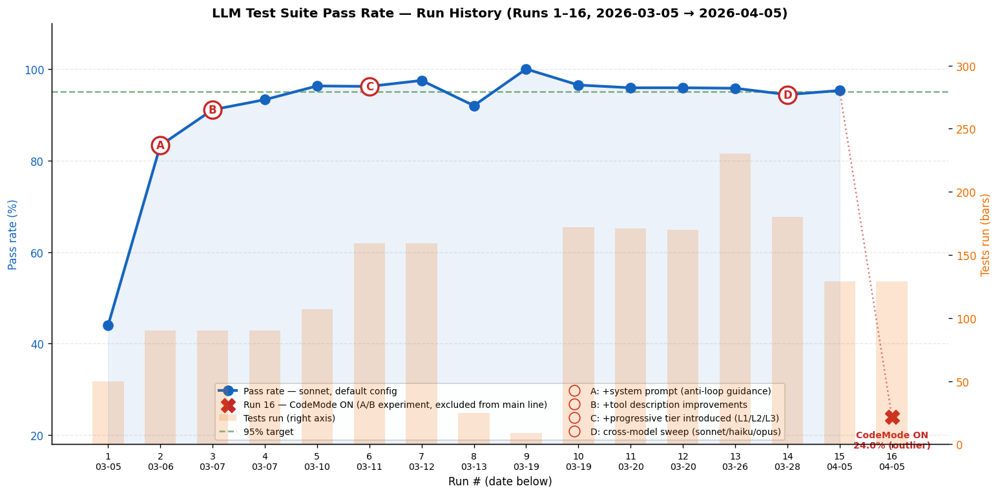
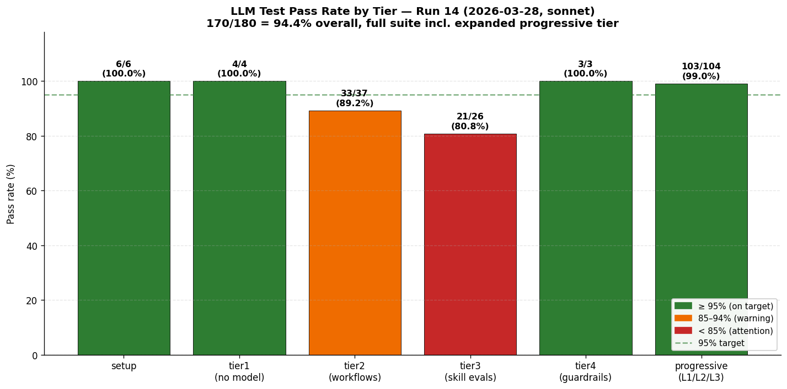
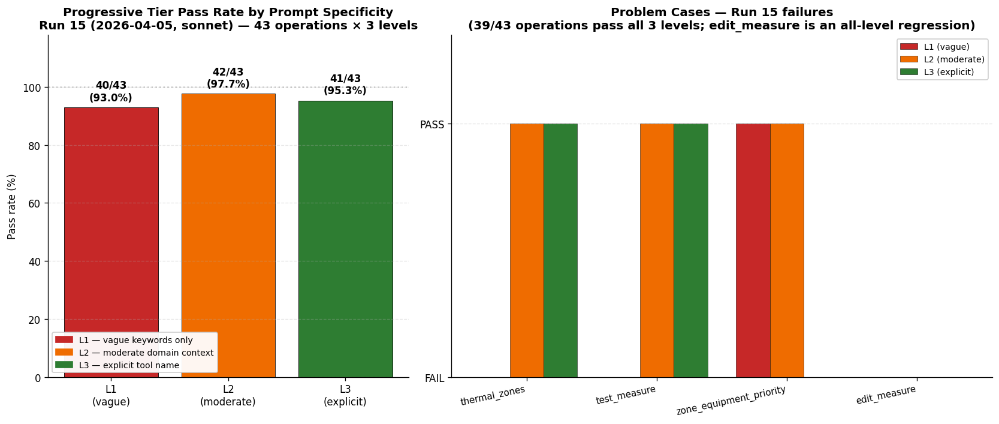
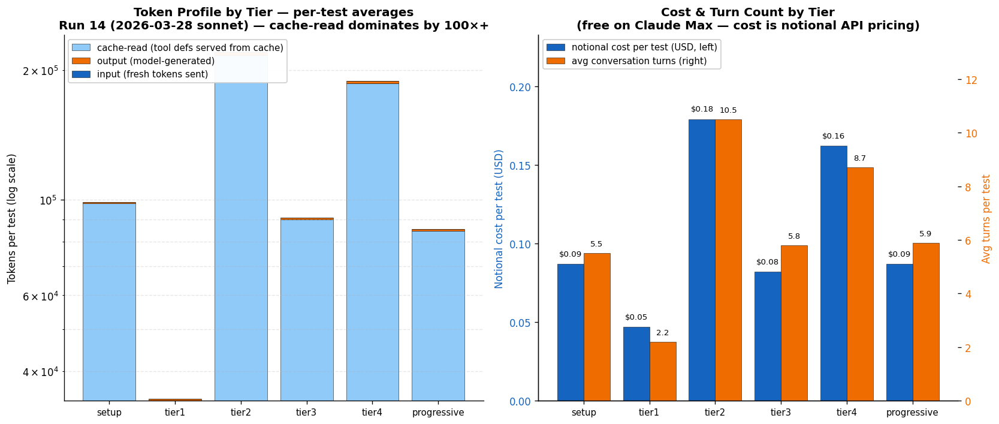
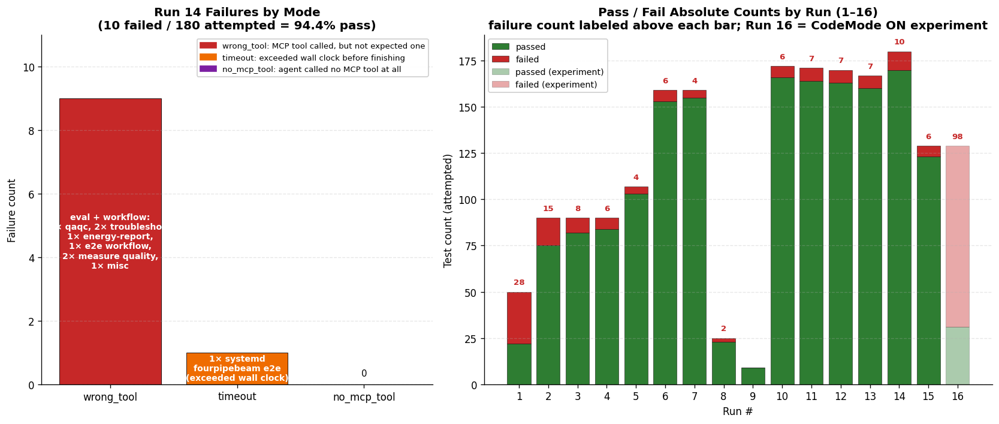

# LLM Testing Methodology, Implementation & Results

**openstudio-mcp** — behavioral testing of an MCP server with ~142 tools, where a real LLM agent drives the tests end-to-end.

> **TL;DR** — 160/167 tests passing (**95.8%**) in Run 13. Core methodology: each tool tested at three prompt specificity levels (L1 vague / L2 moderate / L3 explicit). Pass-rate gap between levels isolates tool-description problems from tool-design problems. System prompt is the single biggest lever (44% → 83% in one run).

---

## 1. Why LLM tests exist

Unit and integration tests verify that MCP tools work in isolation. They don't verify that an LLM agent, given a natural-language request, will **discover and call the correct tool** — the actual user experience.

Examples of failures only LLM tests catch:
- Agent writes raw IDF files to bypass MCP tools (guardrail regression)
- Agent loops on `list_files` forever instead of calling the right tool
- A tool exists but has a docstring so vague the agent never picks it
- A "correct but surprising" rename breaks discovery for every prompt that doesn't mention the new name

The LLM suite is the only gate that measures agent behavior end-to-end against a real Claude session hitting a real openstudio-mcp Docker container.

---

## 2. Architecture

```
pytest (tests/llm/conftest.py)
  │
  ├─ pytest_runtest_protocol ─→ retry loop (up to LLM_TESTS_RETRIES)
  │
  └─ run_claude(prompt, ...)   (tests/llm/runner.py)
        │
        └─ subprocess: claude -p "<prompt>"
                         --output-format stream-json --verbose
                         --mcp-config <generated mcp.json>
                         --max-turns N  --model sonnet
              │
              ├─ stdin ←──── NDJSON stream ────→ _parse_stream_json()
              │                                      │
              │                                      └─→ ClaudeResult
              │                                          (tool_calls, tokens, cost,
              │                                           num_turns, final_text)
              │
              └─ MCP stdio → openstudio-mcp Docker container
                                ├─ stdio_suppression wrapping
                                ├─ 142 MCP tools
                                └─ shared /runs volume (baseline models)
```

### Key implementation points

| Concern | Where | Detail |
|---|---|---|
| Subprocess spawn | `runner.py:181-239` `run_claude()` | Writes temp `mcp.json`, spawns CLI. Strips `CLAUDECODE` env var (nested `claude -p` fails otherwise). |
| Output parsing | `runner.py:242-261` `_parse_stream_json()` | `--output-format stream-json --verbose` is **mandatory** — plain `json` drops `tool_use` blocks. |
| Tool-call extraction | `runner.py:61-106` `ClaudeResult` | Two views: `tool_calls` (all, inc. builtins like ToolSearch/Bash) and `mcp_tool_calls` (MCP-only). |
| Markers & auto-tagging | `conftest.py:42-53, 252-278` | `llm`, `tier1-4`, `stable`, `flaky`, `smoke`, `progressive`, `generic`. Auto-tagged via `FLAKY_TESTS` frozenset. |
| Retry logic | `conftest.py:281-323` | Custom `pytest_runtest_protocol` hook. Each retry consumes one prompt from the budget. |
| Benchmark collection | `conftest.py:342-412, 434-692` | `pytest_runtest_logreport` stores per-test metrics. Session end writes `benchmark.json` / `benchmark.md` / `benchmark_history.json`. |
| Failure classification | `conftest.py:383-390` | `timeout` · `no_mcp_tool` · `wrong_tool`. |
| Prompt budget | `conftest.py` `LLM_TESTS_MAX_PROMPTS` (default 180) | Hard cap prevents runaway cost during iteration. |
| Skill eval auto-discovery | `eval_parser.py:48-90` | Scrapes "Should trigger" / "Should NOT trigger" tables from `.claude/skills/*/eval.md`. |

### Environment knobs

| Var | Default | Purpose |
|---|---|---|
| `LLM_TESTS_ENABLED` | unset | Must be `1` to enable the suite |
| `LLM_TESTS_MODEL` | `sonnet` | `sonnet` / `haiku` / `opus` |
| `LLM_TESTS_RETRIES` | `0` | Retry count for non-determinism |
| `LLM_TESTS_MAX_PROMPTS` | `180` | Hard budget cap |
| `LLM_TESTS_TIER` | `all` | `1`/`2`/`3`/`4`/`all` |
| `LLM_TESTS_RUNS_DIR` | `/tmp/llm-test-runs` | Host path mounted as `/runs` in Docker |

---

## 3. Test taxonomy

Ten test files, organized by what the agent is asked to do.

| File | Tier | ~Count | Purpose | Pass‑rate signal |
|---|---|---|---|---|
| `test_01_setup.py` | setup | 5 | Creates baseline/HVAC/example models in `/runs`. All other tests depend on these. Prompts use explicit tool names to minimize non-determinism. | Dependency gate |
| `test_02_tool_selection.py` | tier1 | 4 | Single-tool discovery, **no model state** (e.g., "What is the server status?"). Fastest tests. | Baseline discovery |
| `test_03_eval_cases.py` | tier3 | 26 | Auto-parsed from `.claude/skills/*/eval.md` "Should trigger" tables. Keeps tests DRY and co-located with skill definitions. | Skill discovery |
| `test_04_workflows.py` | tier2 | 19 | Multi-step chains (3-5 MCP calls): load → weather → HVAC → simulate → extract. | Multi-step composition |
| `test_05_guardrails.py` | tier4 | 3 | **Regression gate**: agent must **NOT** use `Bash`/`Edit`/`Write` to bypass MCP tools. | Safety/bypass |
| `test_06_progressive.py` | progressive | 110 | **The core diagnostic.** 34+ operations × 3 specificity levels. | Tool description quality |
| `test_07_fourpipe_e2e.py` | tier2 | 1 | Full retrofit on 44-zone SystemD model using natural language (no tool names). Two simulations, 40+ turns, ~5 min. | Real-user session |
| `test_08_measure_authoring.py` | tier2 | 8 | Custom measure create/edit/test/export. Regression tests pulled from debug-session JSON exports. | Authoring workflows |
| `test_09_tool_routing.py` | tier4 | 4 | A/B baseline: all 139 tools vs. `recommend_tools` routing. Not in CI. | Tool-routing efficiency |
| `test_10_confusion_pairs.py` | tier4 | 8 | Prompts that could reasonably trigger either of two similar tools (`run_qaqc_checks` vs `validate_model`). | Disambiguation |

### The progressive test pattern (L1 / L2 / L3)

Each operation is tested with **three prompts of increasing specificity**:

| Level | Example (add HVAC) | What it measures |
|---|---|---|
| **L1 — vague** | *"Add HVAC to the building"* | Can the agent discover the tool from keyword scraps alone? → **docstring keyword quality** |
| **L2 — moderate** | *"Add a VAV reheat system to all 10 zones"* | With domain context, can the agent pick the right tool among near-neighbors? → **tool discovery / ToolSearch** |
| **L3 — explicit** | *"Use add_baseline_system to add System 7 VAV reheat"* | Given the exact tool name, does the tool work? → **tool code / API correctness** |

The **gap between levels** is the diagnostic:

- **L1 fails, L2/L3 pass** → docstring is missing keywords. Fast fix. (Example: adding "HVAC / heating and cooling" to `add_baseline_system` made L1 pass immediately in Run 3.)
- **L2 fails, L3 passes** → tool is hard to discover even with context. Fix ToolSearch indexing or tool name.
- **L3 fails** → tool is broken. Fix the code.

This decomposition is why the progressive tier is the most useful part of the suite — it points at the *cause*, not just the symptom.

---

## 4. What gets measured

Every `run_claude()` call yields a `ClaudeResult` object. These fields are written to `benchmark.json`, aggregated into `benchmark.md`, and appended to `benchmark_history.json`.

**Per test:**

| Metric | Source | Meaning |
|---|---|---|
| `passed` | pytest outcome | Binary, *after* retries |
| `attempt` | retry hook | 1 = first try, 2+ = flaky |
| `duration_s` | wall clock | Includes Docker spawn + LLM inference |
| `num_turns` | CLI result | Conversation turns. High = looping. |
| `num_tool_calls` | NDJSON | Total MCP tools invoked |
| `tool_calls` | NDJSON | Ordered list — primary assertion target |
| `input_tokens` | CLI usage | Fresh tokens to model |
| `output_tokens` | CLI usage | Tokens generated |
| `cache_read_tokens` | CLI usage | Served from prompt cache (high = tool defs cached) |
| `cost_usd` | CLI result | **Notional** — free on Claude Max |
| `failure_mode` | `conftest.py:383-390` | `timeout` / `no_mcp_tool` / `wrong_tool` |

**Aggregates:** per-tier pass rate, per-L1/L2/L3 pass rate, token profile by tier, failed-test drill-down with tool sequences, run history (last 50 runs).

**Explicit gaps (things we don't measure yet):**

- **Parameter correctness** — a test passes if the right tool is called, even with wrong arguments.
- **First-attempt pass rate** — retries mask flakiness. Only `attempt` captures it, not aggregates.
- **Time-to-first-tool** — slow ToolSearch discovery isn't penalized.
- **Cross-model comparison** — all runs use one model. No GPT-4 / Gemini data to validate model-agnostic tool descriptions.
- **Error recovery rate** — when a tool returns `ok:False`, does the agent retry or give up?

---

## 5. Results

### Run history — 13 runs, 2026-03-05 to 2026-03-26



| Run | Date | Tests | Passed | Rate | Key change |
|---|---|---|---|---|---|
| 1 | 03-05 | 50 | 22 | **44.0%** | Baseline — no system prompt, wrong model path |
| 2 | 03-06 | 90 | 75 | **83.3%** | **+system prompt (anti-loop), model path fix, pre-check** → +39pp |
| 3 | 03-07 | 90 | 82 | **91.1%** | +tool description improvements → +8pp |
| 4 | 03-07 | 90 | 84 | 93.3% | Stability run (no code changes) |
| 5 | 03-10 | 107 | 103 | 96.3% | +generic access tests, cleanup |
| 6 | 03-11 | 159 | 153 | 96.2% | **+progressive tier (L1/L2/L3)**, workflows, sim setup |
| 7 | 03-12 | 159 | 155 | **97.5%** | Test consolidation (no tool changes) — high-water mark |
| 8 | 03-13 | 25 | 23 | 92.0% | Measure authoring + cooled beam (targeted runs) |
| 9a/b | 03-19 | 9 | 9 | 100% | Tool-routing A/B baseline (9 cases, neutral delta) |
| 10 | 03-19 | 172 | 166 | 96.5% | Full regression: tags, `recommend_tools`, search_api, docstrings — no regressions |
| 11 | 03-20 | 171 | 164 | 95.9% | +ToolSearch + wiring recipes + enriched descriptions. 7 flaky. |
| 12 | 03-20 | 170 | 163 | 95.9% | Description enrichment (all 142 tools ≥40 char). Same 7 flaky. |
| **13** | **03-26** | **230** | **160** | **95.8%** | **Post #40 fix + test audit. 63 skipped. 7 fail. Previously-flaky L1s all passing.** |

The two big inflections are the **system prompt** (Run 1→2, +39pp) and **progressive-tier introduction** (Run 5→6, which massively expanded the test space without dropping pass rate). Everything since Run 10 sits in the 95.8-96.5% band — a regime where improvements are marginal and noise dominates.

### Per-tier pass rate — Run 13



- **setup / tier1 / tier4: 100%** — prerequisites, single-tool discovery, and guardrails are solid.
- **progressive: 98%** (108/110) — the biggest category and the most diagnostic.
- **tier3 skill evals: 92%** — 63 additional tests skipped due to test structure issues (these will reappear in future runs).
- **tier2 workflows: 84%** — lowest tier. Three failures are all `run_qaqc_checks` not being called for validation prompts, i.e. a confusion pair with `validate_model`. Multi-step chains are inherently more fragile than single-tool tests.

### Progressive tier — L1 / L2 / L3



**Left:** aggregate pass rate across 42 progressive cases. L1 93% → L2 95% → L3 100%. The monotone climb is the expected signature of a healthy suite: explicit prompts always succeed, so L3 failures mean broken tools; vague prompts fail more, and the magnitude of the gap tells you how docstring-dependent discovery is.

**Right:** the only cases that don't pass all three levels. All others are 3/3.

| Case | Status | Root cause |
|---|---|---|
| import_floorplan | Now passing at all levels | Was flaky — no file path in vague prompt, agent correctly asks for one |
| list_dynamic_type | Now passing | "What sizing parameters?" was too vague; agent used explicit sizing tools |
| check_loads | Now passing | "What loads?" → agent inspected spaces instead of calling `get_load_details` |
| thermostat | Now passing | "Change thermostat settings" needs direction (up/down, by how much) |
| **run_simulation** | **L1 FAIL (Run 13)** | "Run a simulation" genuinely too vague — agent hesitates on a bare prompt |
| **export_measure** | **L1 & L2 FAIL** | Agent can't discover `export_measure` without the explicit name — durable description gap |

The `export_measure` case is the best example of a real bug the methodology catches: the tool works at L3 (so the implementation is fine), the docstring has keywords, but Claude still doesn't pick it over `list_custom_measures` + `list_files`. Fix is on the tool/description side, not the test.

### Token profile by tier



**Left panel (log scale):** cache-read tokens dominate by 2-3 orders of magnitude. Each invocation loads ~27-50K tokens of tool definitions, and Claude's prompt cache serves them on subsequent tests. This is why a 172-test run only costs ~$12 of notional API pricing — the fresh-token footprint per test is tiny (10-30 in, 400-2800 out).

**Right panel:** cost and turn count per tier. Single-tool tests ≈ 3 turns, $0.06. The cooled-beam comparison workflow is a 22-turn outlier because it runs two full simulations and recovers from sim errors mid-session — it's the only test that costs >$0.10 per run.

### Failure modes — Run 13



**Left:** the 7 Run-13 failures fit three buckets.

| Mode | Count | Cases |
|---|---|---|
| `no_mcp_tool` — agent didn't call any MCP tool | 3 | qaqc tier2 (agent used `validate_model` instead of `run_qaqc_checks`) |
| `wrong_tool` — MCP tool called but not the expected one | 1 | `run_simulation_L1` (intermittent) |
| Measure-quality assertions (new tests) | 3 | measure authoring syntax/structure checks |

The qaqc cluster is the most interesting: both tools legitimately "check the model", and `validate_model` is a defensible answer. This is a **confusion pair** that needs docstring disambiguation, not a bug.

**Right:** absolute pass/fail counts by run. Run 1's 28 failures stand out; runs 5-13 are in a stable <10-failure regime despite the test count roughly quadrupling.

---

## 6. Lessons that changed how the suite is built

1. **System prompts are the biggest lever.** Adding anti-loop guidance to `server.py` `instructions` was a single change that took pass rate from 44% → 83%. Before touching individual tool docstrings, audit the server-wide prompt.

2. **Docstring keywords >> docstring prose.** `add_baseline_system` L1 was failing until we added "HVAC / heating and cooling" to its docstring. A verbose paragraph doesn't help. A single matched keyword does. All 142 tools are now enforced ≥40 chars.

3. **Progressive testing is the best diagnostic tool.** L1/L2/L3 separates three failure classes (description, discovery, code) that a binary pass/fail obscures completely. Every tool should have at least one progressive case.

4. **L1 failures are often structural, not fixable.** "What loads?" is genuinely ambiguous — a good agent asks for clarification. Don't bend a tool description to pass a vague prompt if the agent's alternative behavior is reasonable.

5. **Multi-step workflows are fragile.** Tier 2 is consistently the lowest. ToolSearch + measure execution eats turns; one stall mid-chain fails the whole test. Keep `max_turns` generous (25+ for 3-tool chains, 40+ for e2e).

6. **Retries mask flakiness.** Default `LLM_TESTS_RETRIES=0` gives you the honest first-attempt signal. Only add retries when you need CI-like confidence — and track `attempt` field to see which tests are actually brittle.

7. **Flaky tests need a promotion path.** The `FLAKY_TESTS` frozenset is the quarantine. Pattern-match by substring. Remove patterns when a test stabilizes across 3+ runs. Don't let the list grow indefinitely.

8. **Description guidance alone doesn't fix L1 failures.** See [`benchmark-description-guidance.md`](benchmark-description-guidance.md) — ~35 tools got disambiguation/when-to-use/emphasis edits and L1 pass rate **did not move**. The remaining failures were structural.

9. **NDJSON logs per test are indispensable.** When a test fails, the `.ndjson` log shows the exact tool calls, arguments, error responses, and where the agent got stuck. Clearing them per run keeps disk usage sane.

10. **Stable/flaky classification beats "just run more tests".** Iterating on `-m flaky` (~18 tests, ~10 min) is the right inner loop. Running the full suite is reserved for final validation.

---

## 7. Running the suite

```bash
# Full suite (~100-150 min)
LLM_TESTS_ENABLED=1 pytest tests/llm/ -v

# Smoke subset (~12 tests, ~10 min)
LLM_TESTS_ENABLED=1 pytest tests/llm/ -m smoke -v

# Progressive tier only (~60 min)
LLM_TESTS_ENABLED=1 pytest tests/llm/ -m progressive -v

# Iterate on flaky tests (~10 min)
LLM_TESTS_ENABLED=1 pytest tests/llm/ -m flaky -v

# Single case
LLM_TESTS_ENABLED=1 pytest tests/llm/test_06_progressive.py -k thermostat_L1 -v
```

Reports land in `$LLM_TESTS_RUNS_DIR/benchmark.md` / `benchmark.json`. After each run, copy results into [`llm-test-benchmark.md`](llm-test-benchmark.md) to check into version control.

---

## 8. See also

- [`llm-test-benchmark.md`](llm-test-benchmark.md) — raw benchmark data, per-tool matrix, run history
- [`frameworks-summary.md`](frameworks-summary.md) — unit/integration/LLM side-by-side, strengths & gaps
- [`benchmark-description-guidance.md`](benchmark-description-guidance.md) — negative-result experiment: description edits that didn't move the needle
- [`testing.md`](testing.md) — general testing guide (unit + integration + CI)
- [`plots/generate_plots.py`](plots/generate_plots.py) — reproduce every chart in this doc (`python docs/testing/plots/generate_plots.py`)
